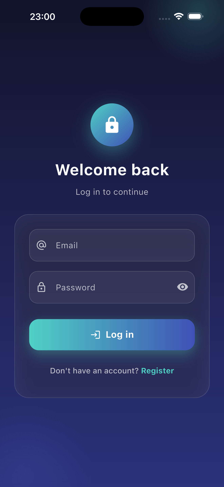
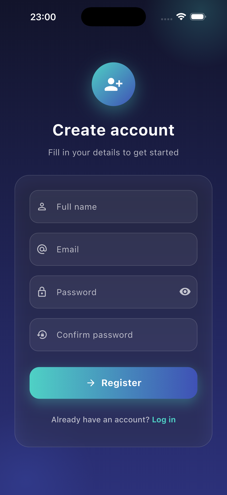
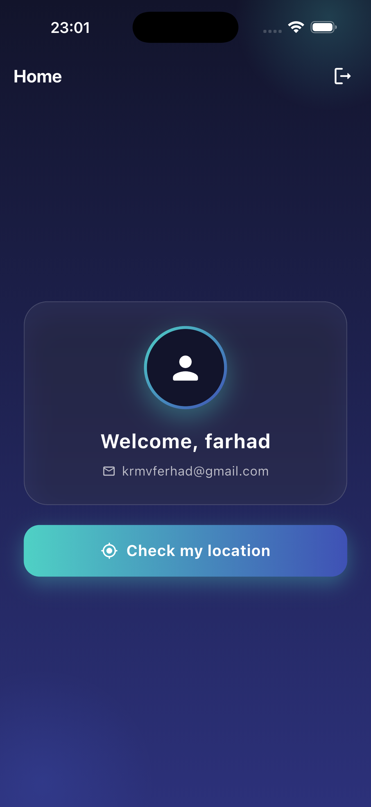
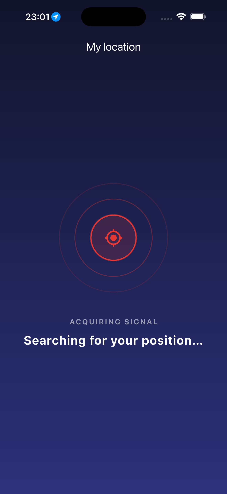
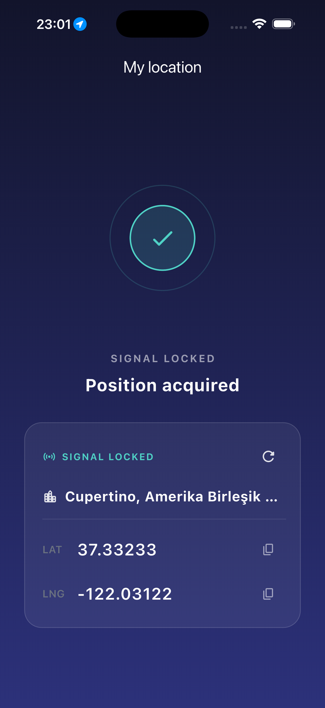

# AuthFlow 🔐

Flutter ilə hazırlanmış, Clean Architecture prinsiplərinə əsaslanan autentifikasiya tətbiqi. Mock JWT sistemi ilə login/qeydiyyat, sessiyanın cihaz yenidən başladıqdan sonra da qorunması, qorunan marşrutlar (route protection), Cubit əsasında advanced state idarəetməsi və geolocation cihaz funksiyası icazə idarəetməsi ilə birlikdə dəstəklənir.

## ✨ Xüsusiyyətlər

- **Login / Qeydiyyat** — email və parol validasiyası ilə forma, real-vaxt xəta göstərilməsi
- **Mock JWT autentifikasiya** — in-memory istifadəçi bazası, fake JWT token generasiyası, şəbəkə xətası simulyasiyası
- **Sessiyanın saxlanması** — `shared_preferences` ilə token/istifadəçi lokal yaddaşda saxlanılır, tətbiq yenidən açılanda avtomatik bərpa olunur
- **Route protection** — `go_router` ilə qorunan səhifələr, auth vəziyyəti asinxron yoxlanılana qədər splash ekranı göstərilir
- **Advanced state management** — `flutter_bloc` (Cubit) əsasında hər feature üçün ayrı state axını
- **Location (cihaz funksiyası)** — `geolocator` + `geocoding` ilə cari məkanın alınması, icazə rədd/servis deaktiv hallarının idarə olunması, tənzimləmələrə yönləndirmə
- **Logout və xəta idarəetməsi** — yanlış parol, mövcud email, şəbəkə xətası kimi hallar istifadəçiyə aydın mesajla göstərilir

## 🏗️ Arxitektura

Layihə **Clean Architecture** prinsipi ilə qat-qat təşkil olunub:

```
lib/
├── app/                          # Tətbiqin kök widget-i (MaterialApp.router)
├── main.dart                     # Giriş nöqtəsi, DI qurulumu
├── core/                         # Ümumi köməkçi qatlar
│   ├── di/                       # Dependency Injection (get_it)
│   ├── network/                  # Dio client
│   ├── router/                   # go_router konfiqurasiyası + auth refresh stream
│   ├── theme/                    # Rənglər / tema
│   ├── utils/                    # Validatorlar
│   └── widgets/                  # Bölünmüş ümumi widget-lər
└── features/                     # Hər feature öz qatları ilə
    ├── auth/
    │   ├── presentation/         # screens, widgets, cubit (Login/Register/Auth)
    │   ├── domain/                # entities, exceptions
    │   └── data/                  # models, repositories (auth, session)
    ├── location/
    │   ├── presentation/         # screen, widgets, cubit
    │   ├── domain/                # entities
    │   └── data/                  # models, repository
    ├── home/
    │   └── presentation/         # ana səhifə, profile/logout/location düymələri
    └── splash/
        └── presentation/         # auth yoxlanışı zamanı splash ekranı
```

Hər feature `presentation` (UI + Cubit), `domain` (entities, exceptions) və `data` (models, repository impl) qatlarına bölünür.

## 🛠️ İstifadə olunan texnologiyalar

| Kateqoriya              | Paket                  |
|--------------------------|------------------------|
| State management          | `flutter_bloc` (Cubit)  |
| Dependency Injection      | `get_it`                |
| Routing                   | `go_router`              |
| Network                   | `dio`                    |
| Local storage (sessiya)   | `shared_preferences`     |
| Location                  | `geolocator`, `geocoding`|
| Responsive UI              | `flutter_screenutil`     |
| Value equality             | `equatable`               |

## 🚀 Başlamaq

### Tələblər

- Flutter SDK (stabil kanal)
- Dart SDK
- Fiziki cihaz və ya emulyator (location icazəsi test etmək üçün fiziki cihaz tövsiyə olunur)

### Quraşdırma

```bash
git clone <repo-url>
cd auth_flow
flutter pub get
```

### İşə salmaq

```bash
flutter run
```

## 🔑 Autentifikasiya haqqında qeyd

Tətbiq real backend əvəzinə **mock JWT** sistemi istifadə edir:

- İstifadəçi qeydiyyatı zamanı yaradılan hesab yalnız runtime ərzində (yaddaşda) saxlanılır — tətbiq tam bağlanıb yenidən qurulduqda (`flutter run` yenidən başladıqda) istifadəçi bazası sıfırlanır.
- Sessiya (token + istifadəçi məlumatı) isə `shared_preferences` ilə cihazda saxlanılır, ona görə tətbiqi bağlayıb yenidən açdıqda giriş vəziyyəti qorunur (əgər istifadəçi əvvəlcə uğurla qeydiyyatdan keçib/daxil olubsa).
- Şəbəkə xətası halını test etmək üçün ~8% ehtimalla süni `NetworkException` yaradılır.

## 📱 Ekranlar

- Splash → auth vəziyyətinin asinxron yoxlanılması
- Login → email/parol ilə giriş, validasiya, xəta mesajları
- Qeydiyyat → yeni hesab yaratma, validasiya
- Ana səhifə → profil kartı, location və logout düymələri
- Location → cari məkanın alınması, icazə/servis vəziyyətlərinin göstərilməsi

## 📸 Ekran görüntüləri

<table>
<tr>
<td align="center"><b>Login</b><br/></td>
<td align="center"><b>Qeydiyyat</b><br/></td>
<td align="center"><b>Ana səhifə</b><br/></td>
</tr>
<tr>
<td align="center"><b>Location (axtarır)</b><br/></td>
<td align="center"><b>Location (tapıldı)</b><br/></td>
<td></td>
</tr>
</table>

## 📝 Lisenziya

Bu layihə təhsil/nümayiş məqsədləri üçün hazırlanmışdır.
